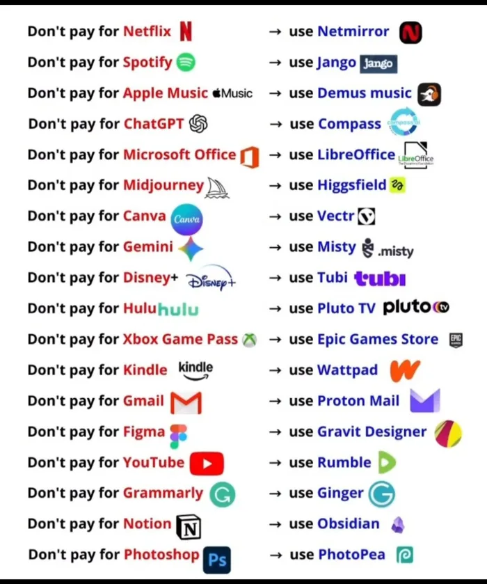

# 🌍 ¿Pagar o explorar?  
## Entendiendo alternativas en internet

---

  

## 🧠 Primero, respira

La imagen que viste dice algo como:

> “No pagues por X, usa Y”

Pero antes de creer cualquier imagen en internet, vamos a hacer algo más importante:

👉 **Pensar.**

No todo lo que se comparte es una recomendación perfecta.  
No todo lo gratuito es mejor.  
No todo lo que cuesta dinero es malo.

Este README no es para decirte qué usar.  
Es para ayudarte a entender qué está pasando.

---

## 📷 ¿Qué muestra la imagen?

La imagen compara servicios conocidos (como plataformas de música, películas, diseño o estudio) con otras opciones que dicen ser:

- gratuitas  
- alternativas  
- “mejores”  
- diferentes  

Básicamente está diciendo:

> “En lugar de pagar por esto… usa esto otro.”

---

## 🎯 ¿Qué puedes aprender de esto?

Más que cambiar de app, puedes aprender algo más valioso:

### 🌱 1. Siempre existen alternativas

En internet casi nunca hay una sola opción.

- Si existe una plataforma famosa
- probablemente existe otra menos conocida
- y otra más pequeña
- y otra gratis

Eso se llama **competencia y diversidad digital**.

---

### 🔎 2. Gratis no siempre significa igual

Algunas preguntas importantes:

- ¿Es legal?
- ¿Es segura?
- ¿Respeta tus datos?
- ¿Tiene la misma calidad?
- ¿Tiene anuncios?
- ¿Funciona igual de bien?

A veces lo gratis:
- tiene más publicidad
- tiene menos funciones
- o funciona diferente

Y eso está bien, si sabes lo que eliges.

---

### 🛡️ 3. Cuidado con lo que promete “no pagues nunca”

Algunas plataformas viven de:

- anuncios
- vender datos
- funciones limitadas
- versiones premium ocultas

Nada es realmente “mágico”.

Si algo es gratis, pregúntate:

> ¿Cómo gana dinero esta empresa?

Eso es pensamiento crítico.

---

## 💡 Lo más importante

La imagen no es mala.  
Pero tampoco es una verdad absoluta.

Es solo una invitación a preguntarte:

- ¿Qué necesito realmente?
- ¿Vale la pena pagar?
- ¿Prefiero una versión gratuita con límites?
- ¿Me importa la privacidad?
- ¿Me importa la calidad?

---

## 🧩 Repetimos la idea (porque ayuda)

No se trata de:

❌ “No pagues nunca”  
❌ “Lo gratis es mejor”  

Se trata de:

✅ Saber que hay opciones  
✅ Investigar antes de elegir  
✅ Entender las consecuencias  
✅ Decidir con criterio  

---

## 🧠 Mini ejercicio

Elige una de las comparaciones de la imagen y pregúntate:

1. ¿Para qué usaría yo esa herramienta?
2. ¿La usaría diario o solo a veces?
3. ¿Me importa que tenga anuncios?
4. ¿Estoy dispuesto a pagar por comodidad?

No necesitas responder perfecto.  
Solo pensar ya es suficiente.

---

## 🌈 Mensaje final

Internet está lleno de opciones.

Pero lo más valioso no es encontrar lo gratis.

Es aprender a elegir con criterio.

Y eso sí cambia la vida.