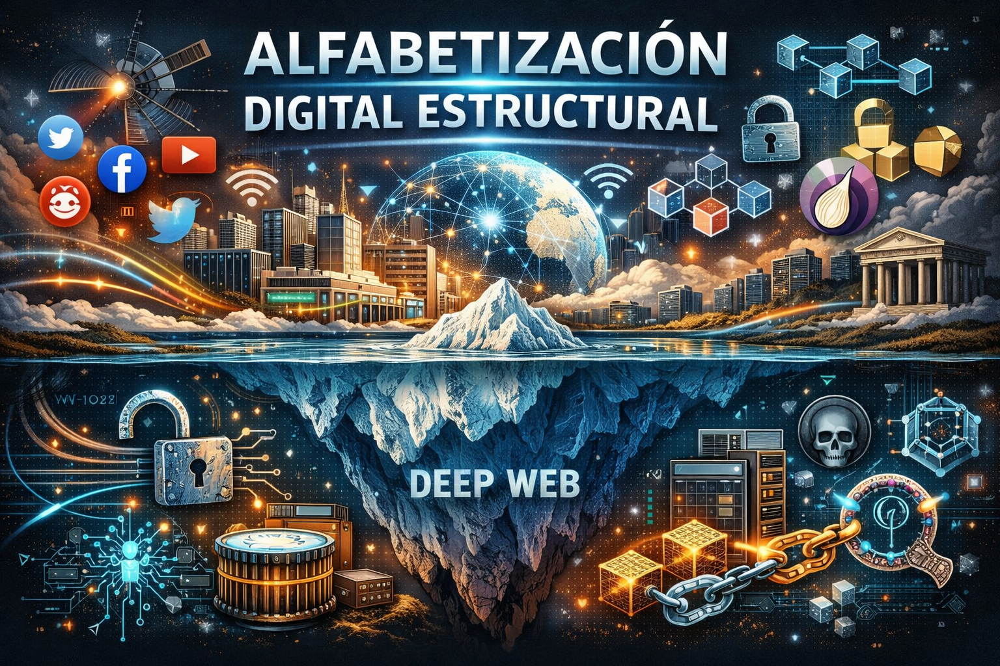

  

# 🌐 Árbol de Alfabetización Digital Estructural  
*(Versión panorámica → dominio)*

---

# 🟢 A1 · Mapa Completo del Territorio Digital  
*(Panorámica sin profundidad técnica)*

## 1. Internet como sistema
- Infraestructura física (cables, servidores)
- Protocolos como acuerdos humanos
- Red de redes
- Superficie vs infraestructura

## 2. Plataformas y poder
- Qué es una plataforma
- Centralización
- Quién decide lo que vemos

## 3. Herramientas, no magia
- IA como herramienta
- Algoritmos como filtros
- Automatización básica

## 4. Atención y economía digital
- Economía de la atención
- Publicidad como modelo
- Datos como activo

## 5. Identidad digital
- Usuario vs persona
- Huella digital
- Reputación acumulativa

## 6. Seguridad básica
- Contraseñas
- Verificación en dos pasos
- Riesgos comunes

## 7. Internet comercial vs no comercial
- Plataformas grandes
- Blogs y foros independientes
- Comunidades pequeñas

## 8. Navegadores como puertas
- Qué es un navegador
- Indexación
- Motores de búsqueda

## 9. Deep Web (desmitificación)
- Qué significa “no indexado”
- Infraestructura invisible
- Narrativa vs realidad

## 10. Blockchain (visión general)
- Registro distribuido
- Confianza sin intermediario
- Narrativa vs uso real

## 11. Computación cuántica (visión general)
- Qué significa “cuántico”
- Diferencia con computación clásica
- Qué problemas promete resolver

---

# 🟡 A2 · Comprensión de Sistemas

## 1. Cómo funcionan los algoritmos
- Recomendación
- Ranking
- Personalización

## 2. Modelos de negocio digitales
- Publicidad
- Suscripción
- Venta de datos

## 3. Arquitectura de plataformas
- Backend y frontend (conceptual)
- Moderación
- Incentivos

## 4. Reddit como ecosistema
- Subcomunidades
- Moderadores
- Cultura comunitaria

## 5. Cookies y rastreo
- Qué es una cookie
- Seguimiento entre sitios
- Perfilado básico

## 6. Introducción conceptual a VPN
- Qué protege
- Qué no protege
- Casos de uso

## 7. Blockchain más allá del mito
- Descentralización real vs aparente
- Casos útiles
- Limitaciones

## 8. Computación cuántica y criptografía
- Riesgo futuro para seguridad
- Investigación actual

---

# 🟠 B1 · Autonomía Digital

## 1. Gestión consciente de identidad
- Separación de perfiles
- Reputación estratégica

## 2. Privacidad práctica
- Configuraciones clave
- Minimización de exposición

## 3. Curaduría de información
- Evaluar fuentes
- Señales de manipulación

## 4. Participación en comunidades
- Normas implícitas
- Construcción de reputación

## 5. Infraestructura alternativa
- RSS
- Fediverso (conceptual)
- Comunidades descentralizadas

## 6. Modelos de amenaza personales
- Qué quiero proteger
- De quién
- Por qué

---

# 🔵 B2 · Análisis Crítico del Ecosistema

## 1. Capitalismo de datos
- Datos como recurso
- Monetización estructural

## 2. Geopolítica digital
- Infraestructura global
- Soberanía tecnológica

## 3. Centralización vs descentralización
- Ventajas
- Riesgos

## 4. Arquitectura de vigilancia
- Seguimiento masivo
- Diseño persuasivo

## 5. Narrativa cultural del internet oscuro
- Miedo mediático
- Realidad técnica

## 6. Blockchain como fenómeno económico
- Especulación
- Gobernanza
- Incentivos

## 7. Futuro de la criptografía
- Impacto cuántico
- Nuevos modelos

---

# 🔴 C1 · Dominio Estructural y Capacidad de Explicar

## 1. Diseñar entornos digitales responsables
## 2. Evaluar nuevas tecnologías sin mitificarlas
## 3. Modelar riesgos complejos
## 4. Analizar poder digital sistémico
## 5. Enseñar alfabetización digital
## 6. Construir comunidades digitales sanas
## 7. Pensar el futuro del internet