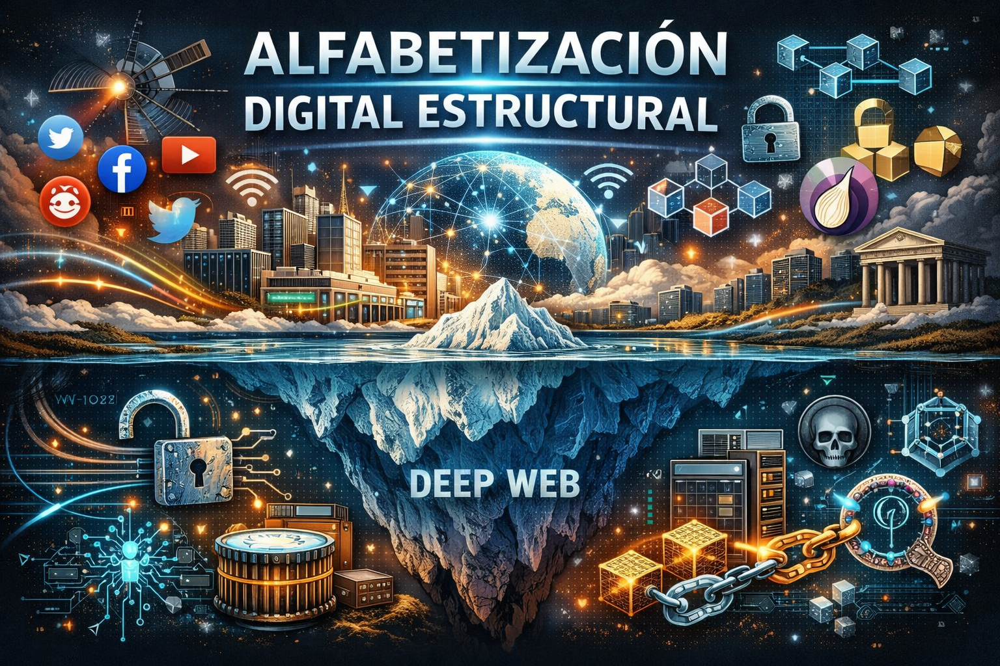

  

# 🌐 Árbol de Alfabetización Digital Estructural
*(Versión panorámica → dominio)*

---

# 🟢 A1 · Mapa Completo del Territorio Digital
*(Panorámica sin profundidad técnica)*

## 1. Internet como sistema
- Infraestructura física (cables, servidores)
- Protocolos como acuerdos humanos
- Red de redes
- Superficie vs infraestructura
- Diferencia entre internet y la web

## 2. Historia breve del internet
- Origen académico y militar
- La web abierta
- Web 2.0 y plataformas sociales
- Centralización progresiva del ecosistema digital

## 3. Plataformas y poder
- Qué es una plataforma
- Centralización
- Quién decide lo que vemos
- Interfaces e influencia sobre el comportamiento

## 4. Herramientas, no magia
- IA como herramienta
- Algoritmos como filtros
- Automatización básica

## 5. Atención y economía digital
- Economía de la atención
- Publicidad como modelo
- Datos como activo
- Gratuito vs monetizado indirectamente

## 6. Identidad digital
- Usuario vs persona
- Huella digital
- Persistencia de la información
- Reputación acumulativa

## 7. Seguridad básica
- Contraseñas
- Verificación en dos pasos
- Riesgos comunes
- Ingeniería social básica

## 8. Internet comercial vs no comercial
- Plataformas grandes
- Blogs y foros independientes
- Comunidades pequeñas

## 9. Navegadores como puertas
- Qué es un navegador
- Indexación
- Motores de búsqueda
- Correo electrónico y servicios en la nube

## 10. Deep Web (desmitificación)
- Qué significa "no indexado"
- Infraestructura invisible
- Narrativa vs realidad

## 11. Blockchain (visión general)
- Registro distribuido
- Confianza sin intermediario
- Narrativa vs uso real

## 12. Computación cuántica (visión general)
- Qué significa "cuántico"
- Diferencia con computación clásica
- Qué problemas promete resolver

---

# 🟡 A2 · Comprensión de Sistemas

## 1. Cómo funcionan los algoritmos
- Recomendación
- Ranking
- Personalización
- Burbujas de información

## 2. Modelos de negocio digitales
- Publicidad
- Suscripción
- Venta de servicios
- Monetización de datos

## 3. Arquitectura de plataformas
- Backend y frontend (conceptual)
- Moderación
- Incentivos
- Escalabilidad

## 4. Comunidades digitales
- Subcomunidades (Reddit como caso de estudio)
- Moderadores
- Cultura comunitaria
- Normas implícitas
- Construcción de reputación comunitaria

## 5. Cookies y rastreo
- Qué es una cookie
- Seguimiento entre sitios
- Perfilado básico
- Publicidad personalizada

## 6. Introducción conceptual a VPN
- Qué protege
- Qué no protege
- Casos de uso
- Limitaciones prácticas

## 7. Blockchain más allá del mito
- Descentralización real vs aparente
- Casos útiles
- Limitaciones

## 8. Computación cuántica y criptografía
- Riesgo futuro para seguridad
- Investigación actual

---

# 🟠 B1 · Autonomía Digital

## 1. Gestión consciente de identidad
- Separación de perfiles
- Reputación estratégica
- Identidad personal, pública y profesional

## 2. Privacidad práctica
- Configuraciones clave
- Minimización de exposición
- Gestión de permisos y accesos
- Hábitos de seguridad cotidiana

## 3. Curaduría de información
- Evaluar fuentes
- Señales de manipulación
- Verificación básica de información
- Diferenciar ruido de valor

## 4. Participación en comunidades
- Normas implícitas
- Construcción de reputación
- Comunicación digital responsable
- Dinámicas sociales en línea

## 5. Infraestructura alternativa
- RSS
- Blogs independientes
- Fediverso (conceptual)
- Comunidades descentralizadas

## 6. Modelos de amenaza personales
- Qué quiero proteger
- De quién
- Por qué

## 7. Diseño de entorno digital personal
- Organización de información
- Rutinas digitales conscientes
- Gestión de atención
- Reducción de dependencia algorítmica

---

# 🔵 B2 · Análisis Crítico del Ecosistema

## 1. Capitalismo de datos
- Datos como recurso
- Monetización estructural
- Incentivos económicos de las plataformas

## 2. Geopolítica digital
- Infraestructura global
- Soberanía tecnológica
- Dependencias estratégicas
- Empresas tecnológicas como actores geopolíticos

## 3. Centralización vs descentralización
- Ventajas
- Riesgos
- Dependencia tecnológica
- Narrativas descentralizadas

## 4. Arquitectura de vigilancia
- Seguimiento masivo
- Diseño persuasivo
- Sistemas de captura conductual

## 5. Narrativa cultural del internet oscuro
- Miedo mediático
- Realidad técnica
- IA, blockchain, deep web y computación cuántica como narrativa

## 6. Blockchain como fenómeno económico
- Especulación
- Gobernanza
- Incentivos

## 7. Futuro de la criptografía
- Impacto cuántico
- Nuevos modelos

## 8. Impacto humano del ecosistema digital
- Psicología de plataformas
- Ansiedad informativa
- Tribalismo digital
- Radicalización algorítmica
- Burnout digital

---

# 🔴 C1 · Dominio Estructural y Capacidad de Explicar

## 1. Diseñar entornos digitales responsables
- Ética del diseño
- Incentivos saludables
- Experiencia de usuario consciente
- Impacto social del diseño tecnológico

## 2. Evaluar nuevas tecnologías sin mitificarlas
- Separar narrativa de realidad técnica
- Marcos de evaluación crítica
- Casos históricos de hype tecnológico

## 3. Modelar riesgos complejos
- Riesgos personales
- Riesgos organizacionales
- Riesgos sociales
- Evaluación contextual de amenazas

## 4. Analizar poder digital sistémico
- Infraestructura y control
- Gobernanza tecnológica
- Concentración de plataformas
- Relación entre tecnología y poder

## 5. Enseñar alfabetización digital
- Traducción de complejidad
- Comunicación pedagógica
- Explicación sin tecnicismos innecesarios
- Diseño de experiencias de aprendizaje

## 6. Construir comunidades digitales sanas
- Cultura comunitaria
- Moderación
- Normas e incentivos
- Prevención de dinámicas destructivas

## 7. Pensar el futuro del internet
- Tendencias emergentes
- Riesgos estructurales
- Escenarios posibles
- Futuro de la identidad, privacidad y gobernanza digital
